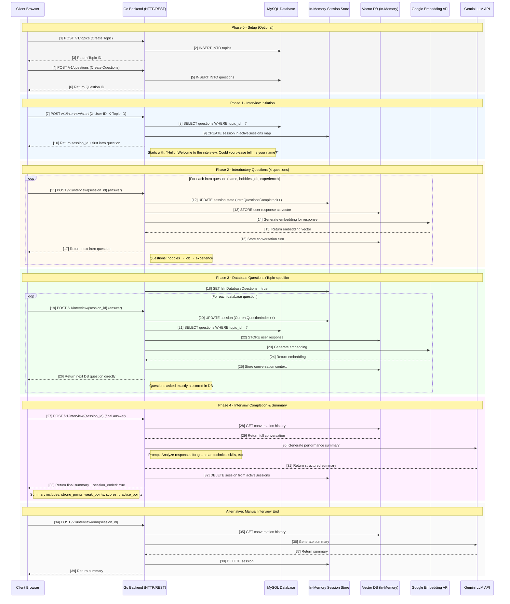

## Build docker image 
```
docker build -t go-docker-app .
```

## Run docker image 
```
docker run -p 8080:8080 go-docker-app
```

data flow:

```mermaid
sequenceDiagram
    participant Client as Client Browser
    participant Backend as Go Backend (HTTP/REST)
    participant DB as MySQL Database
    participant Memory as In-Memory Session Store
    participant VecDB as Vector DB (In-Memory)
    participant Embed as Google Embedding API
    participant LLM as Gemini LLM API

    %% ------------------- Topic & Question Setup -------------------
    rect rgb(245, 245, 245)
    note over Client,LLM: Phase 0 - Setup (Optional)
    Client->>Backend: [1] POST /v1/topics (Create Topic)
    Backend->>DB: [2] INSERT INTO topics
    Backend-->>Client: [3] Return Topic ID
    Client->>Backend: [4] POST /v1/questions (Create Questions)
    Backend->>DB: [5] INSERT INTO questions
    Backend-->>Client: [6] Return Question ID
    end

    %% ------------------- Interview Initiation -------------------
    rect rgb(240, 248, 255)
    note over Client,LLM: Phase 1 - Interview Initiation
    Client->>Backend: [7] POST /v1/interview/start (X-User-ID, X-Topic-ID)
    Backend->>DB: [8] SELECT questions WHERE topic_id = ?
    Backend->>Memory: [9] CREATE session in activeSessions map
    Backend-->>Client: [10] Return session_id + first intro question
    note right of Backend: Starts with: "Hello! Welcome to the interview. Could you please tell me your name?"
    end

    %% ------------------- Introductory Questions Phase -------------------
    rect rgb(255, 250, 240)
    note over Client,LLM: Phase 2 - Introductory Questions (4 questions)
    loop For each intro question (name, hobbies, job, experience)
        Client->>Backend: [11] POST /v1/interview/{session_id} (answer)
        Backend->>Memory: [12] UPDATE session state (IntroQuestionsCompleted++)
        Backend->>VecDB: [13] STORE user response as vector
        Backend->>Embed: [14] Generate embedding for response
        Embed-->>Backend: [15] Return embedding vector
        Backend->>VecDB: [16] Store conversation turn
        Backend-->>Client: [17] Return next intro question
        note right of Backend: Questions: hobbies → job → experience
    end
    end

    %% ------------------- Database Questions Phase -------------------
    rect rgb(240, 255, 240)
    note over Client,LLM: Phase 3 - Database Questions (Topic-specific)
    Backend->>Memory: [18] SET IsInDatabaseQuestions = true
    loop For each database question
        Client->>Backend: [19] POST /v1/interview/{session_id} (answer)
        Backend->>Memory: [20] UPDATE session (CurrentQuestionIndex++)
        Backend->>DB: [21] SELECT questions WHERE topic_id = ?
        Backend->>VecDB: [22] STORE user response
        Backend->>Embed: [23] Generate embedding
        Embed-->>Backend: [24] Return embedding
        Backend->>VecDB: [25] Store conversation context
        Backend-->>Client: [26] Return next DB question directly
        note right of Backend: Questions asked exactly as stored in DB
    end
    end

    %% ------------------- Interview Completion -------------------
    rect rgb(255, 240, 255)
    note over Client,LLM: Phase 4 - Interview Completion & Summary
    Client->>Backend: [27] POST /v1/interview/{session_id} (final answer)
    Backend->>VecDB: [28] GET conversation history
    VecDB-->>Backend: [29] Return full conversation
    Backend->>LLM: [30] Generate performance summary
    note right of Backend: Prompt: Analyze responses for grammar, technical skills, etc.
    LLM-->>Backend: [31] Return structured summary
    Backend->>Memory: [32] DELETE session from activeSessions
    Backend-->>Client: [33] Return final summary + session_ended: true
    note right of Client: Summary includes: strong_points, weak_points, scores, practice_points
    end

    %% ------------------- Optional: Manual End -------------------
    rect rgb(250, 250, 250)
    note over Client,LLM: Alternative: Manual Interview End
    Client->>Backend: [34] POST /v1/interview/end/{session_id}
    Backend->>VecDB: [35] GET conversation history
    Backend->>LLM: [36] Generate summary
    LLM-->>Backend: [37] Return summary
    Backend->>Memory: [38] DELETE session
    Backend-->>Client: [39] Return summary
    end
```