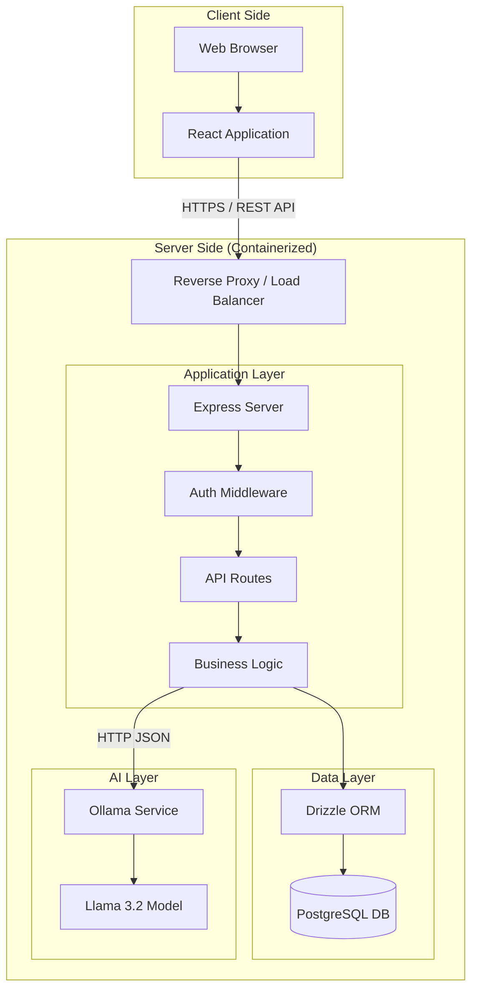
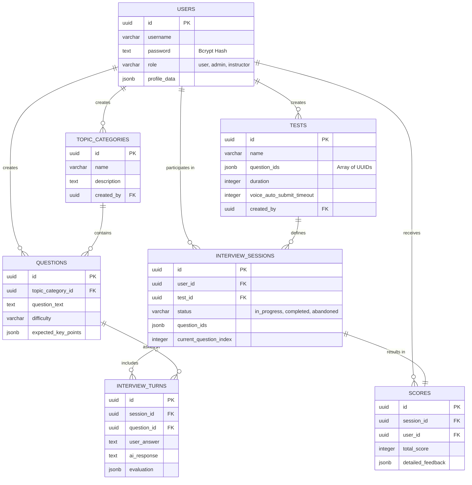
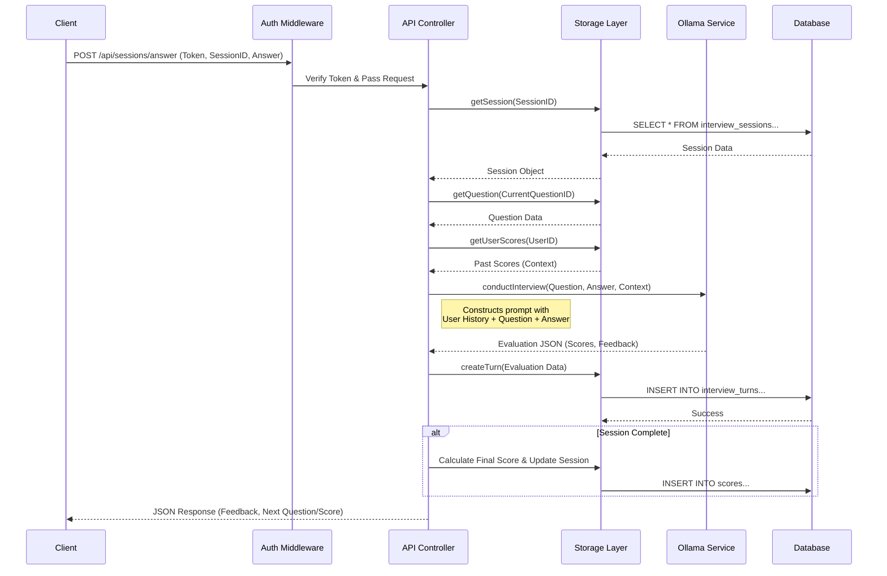

# Technical Design Document: Interview Engine Backend

## 1. High-Level Architecture

### Architectural Pattern
The system follows a **Monolithic Architecture** with a clear separation of concerns between the API layer, Business Logic, and Data Access layer. It is designed to be container-friendly and stateless, allowing for horizontal scaling if needed (excluding the local LLM dependency).

### Technology Stack

| Component | Technology | Purpose |
| :--- | :--- | :--- |
| **Runtime** | Node.js (v20+) | Server-side execution environment. |
| **Framework** | Express.js | REST API handling, middleware, and routing. |
| **Database** | PostgreSQL | Relational persistence for users, sessions, and scores. |
| **ORM** | Drizzle ORM | Type-safe database interaction and schema definition. |
| **Authentication** | JWT (jsonwebtoken) | Stateless authentication mechanism. |
| **Security** | bcryptjs | Password hashing. |
| **AI / LLM** | Ollama | Local LLM inference for interview simulation. |
| **Validation** | Zod | Runtime schema validation for API inputs. |
| **Build Tool** | Vite | Frontend build and development server. |
| **Language** | TypeScript | Static typing for both client and server. |

### System Architecture Diagram



---

## 2. Database Design & Schema

### Entity Relationship Diagram (ERD)



### Detailed Schema Definitions

#### 1. Users
Stores user credentials and profile information.
```sql
CREATE TABLE users (
  id UUID PRIMARY KEY DEFAULT gen_random_uuid(),
  username VARCHAR(255) NOT NULL UNIQUE,
  password TEXT NOT NULL, -- Bcrypt hash
  role VARCHAR(50) NOT NULL DEFAULT 'user', -- 'user', 'admin', 'instructor'
  full_name TEXT,
  email VARCHAR(255),
  profile_data JSONB, -- { bio, skills, experience, education }
  created_at TIMESTAMP NOT NULL DEFAULT NOW()
);
```

#### 2. Tests
Defines the structure of an interview, including the specific questions to be asked.
```sql
CREATE TABLE tests (
  id UUID PRIMARY KEY DEFAULT gen_random_uuid(),
  name VARCHAR(255) NOT NULL,
  description TEXT,
  question_ids JSONB NOT NULL DEFAULT '[]', -- Array of question UUIDs
  duration INTEGER, -- in minutes
  difficulty VARCHAR(50),
  voice_auto_submit_timeout INTEGER NOT NULL DEFAULT 3000,
  is_active BOOLEAN NOT NULL DEFAULT true,
  created_by UUID REFERENCES users(id),
  created_at TIMESTAMP NOT NULL DEFAULT NOW()
);
```

#### 3. Interview Turns
Stores the granular interaction data for every question asked and answered.
```sql
CREATE TABLE interview_turns (
  id UUID PRIMARY KEY DEFAULT gen_random_uuid(),
  session_id UUID NOT NULL REFERENCES interview_sessions(id),
  question_id UUID NOT NULL REFERENCES questions(id),
  turn_number INTEGER NOT NULL,
  user_answer TEXT NOT NULL,
  ai_response TEXT NOT NULL,
  evaluation JSONB, -- { grammar, technical, depth, communication, feedback, strengths, areasToImprove }
  created_at TIMESTAMP NOT NULL DEFAULT NOW()
);
```

---

## 3. Feature Logic & Data Flow

### 3.1 Authentication & Authorization
*   **Mechanism:** JWT (JSON Web Tokens).
*   **Token Expiry:** 7 days.
*   **Middleware:**
    *   `authMiddleware`: Verifies `Bearer` token in Authorization header. Attaches `user` payload to request.
    *   `adminMiddleware`: Checks if `req.user.role` is `admin` or `instructor`.

### 3.2 Interview Session Flow
The core loop of the application.

1.  **Start Session:** User selects a Test -> System creates `interview_sessions` record -> Returns first question.
2.  **Answer Submission:** User submits text/voice answer -> System processes with AI -> Saves `interview_turns`.
3.  **Completion:** System detects last question -> Aggregates scores -> Creates `scores` record -> Updates session status.

### 3.3 Analytics Engine
The system calculates analytics on-the-fly using SQL aggregations in `storage.ts`.

*   **User Stats:**
    *   `averageScore`: Avg of all `total_score` for the user.
    *   `improvement`: Comparison of avg score of last 5 tests vs previous 5.
*   **Admin Stats:**
    *   `sessionsByDay`: Daily count of completed sessions (Last 30 days).
    *   `gradeDistribution`: Count of A/B/C/D/F grades across all users.

### Sequence Diagram: Interview Answer Submission



---

## 4. AI Integration & Prompt Engineering

The system uses a **Context-Aware Generation** pattern. It does not use a Vector DB but retrieves structured context from the relational database.

### 4.1 Prompt Structure
The system uses a two-part prompt strategy:

**1. System Prompt (Persona Definition):**
> "You are a professional AI interviewer conducting a mock technical interview. Act naturally and conversationally... Evaluate the answer on these criteria (0-100 scale): Grammar, Technical, Depth, Communication. Provide your response in JSON format..."

**2. User Prompt (Context Injection):**
> "Candidate: {username}. Previous average scores: {past_scores}
> Interview Question: {question_text}
> Candidate's Answer: {user_answer}
> Please evaluate this answer and provide your feedback."

### 4.2 Output Parsing
The system expects a JSON response from the LLM. It includes robust error handling to clean markdown code blocks (```json) that LLMs often include, ensuring the JSON is parseable.

---

## 5. Operational & Security

### 5.1 Security Measures
*   **Password Hashing:** All passwords are hashed using `bcrypt` with a salt round of 10.
*   **Role-Based Access Control (RBAC):** Strict middleware checks for Admin/Instructor routes.
*   **Environment Variables:** Secrets (SESSION_SECRET) and Config (OLLAMA_URL) are managed via `.env`.

### 5.2 Deployment (Docker)
The application is containerized using a multi-stage build process to minimize image size.

*   **Build Stage:** Installs all dependencies, builds the frontend (Vite) and backend (TypeScript).
*   **Production Stage:** Copies only `dist` files and production dependencies. Runs as a non-root user (`nodejs`) for security.
*   **Health Check:** Implements a health check endpoint (`/api/health`) for orchestration (Kubernetes/Docker Swarm).

### 5.3 Error Handling
A global error handler middleware catches all exceptions, ensuring the server doesn't crash and returns standardized JSON error responses (`{ message: string }`) to the client.
